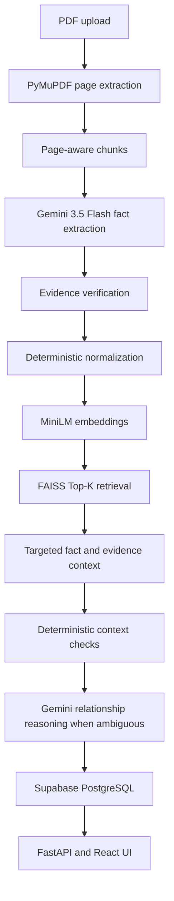

# Fact Knowledge Layer

A small fact-centric prototype for extracting grounded facts from PDF documents, normalizing them, finding candidate matches, and explaining relationships between facts.

## Setup and Run Instructions

### Prerequisites

- Python 3.11+
- Node.js 18+
- A Supabase project for persistent storage
- A Google Gemini API key for live fact extraction and relationship reasoning

### Backend

```powershell
python -m venv .venv
.venv\Scripts\Activate.ps1
pip install -e ".[test]"
Copy-Item .env.example .env
```

Set these values in `.env`:

```env
GEMINI_API_KEY=your-key
GEMINI_MODEL=gemini-3.5-flash
SUPABASE_URL=https://your-project.supabase.co
SUPABASE_KEY=your-key
SUPABASE_DB_URL=postgresql://...
```

Apply `supabase/migrations/0001_initial_schema.sql` in the Supabase SQL editor. Start the API with:

```powershell
uvicorn app.main:app --reload
```

The API is available at `http://localhost:8000`; interactive documentation is at `http://localhost:8000/docs`.

### Frontend

```powershell
cd frontend
npm install
npm run dev
```

Open `http://localhost:5173`. Use the upload control to send a new PDF to `POST /documents/upload`. The starter PDFs are intentionally local-only and are ignored by Git.

## Video Demo


## Approach

The system is fact-centric rather than a generic PDF chatbot:



PyMuPDF owns document reading and page boundaries. Gemini is reserved for semantic work: dynamic fact extraction, ambiguous interpretation, relationship reasoning, and grounded explanations. Numeric normalization, period parsing, quote verification, FAISS search, and validation stay deterministic.

Facts use a flexible subject/predicate/value shape instead of a fixed list of metrics. Each fact carries source document, page, quote, offsets when available, confidence, qualifiers, time, scope, and status. A quote that cannot be found on its source page is marked `EVIDENCE_FAILED`.

Embeddings use `sentence-transformers/all-MiniLM-L6-v2`. FAISS retrieves likely candidates; it does not decide whether facts contradict. Candidate pairs are compared with time, scope, geography, normalized values, and qualifiers before Gemini is asked to resolve ambiguity.

Processing is incremental in design: facts from a new document are normalized, added to the vector index, and compared with retrieved existing candidates. Supabase is the source of truth; FAISS is a replaceable retrieval index.

## Architecture

The main code boundaries are:

- `app/ingestion.py`: page-aware PDF extraction and evidence verification
- `app/llm/`: Google GenAI client, fact extractor, and relationship reasoner
- `app/normalization.py`: deterministic numeric, text, period, and fact normalization
- `app/retrieval/`: MiniLM embedding and FAISS candidate retrieval
- `app/reasoning/`: deterministic relationship checks
- `app/pipeline.py`: extraction-to-comparison orchestration
- `app/db/`: Supabase repository and persistence writer
- `app/main.py`: FastAPI upload and read endpoints
- `frontend/`: React review interface

The core of the system is grounded fact extraction and contextual comparison. Retrieval and visualization support that process; they are not substitutes for it.

## Important Decisions and Trade-offs

- **Supabase instead of SQLite:** the assignment requires PostgreSQL-backed shared persistence and Supabase provides a hosted deployment path.
- **FAISS:** it is lightweight and makes Top-K candidate retrieval explicit. It can later be replaced by Supabase pgvector behind `VectorIndex`.
- **MiniLM:** `all-MiniLM-L6-v2` is small enough for local development and captures more context than embedding only a number.
- **Targeted RAG:** only candidate facts, evidence quotes, pages, and nearby context are supplied to reasoning. The whole PDF is not repeatedly sent to an LLM.
- **Deterministic normalization:** arithmetic and evidence checks are more reproducible in code than in a model response.
- **Gemini reasoning:** semantic interpretation is useful when periods, scope, measurement definitions, or wording are ambiguous.
- **Evidence verification:** it prevents unsupported model output from being presented as a grounded fact.
- **Dynamic schema:** new predicates can be extracted without adding a new hard-coded metric type.
- **No all-pairs comparison:** FAISS reduces unnecessary comparisons as the fact collection grows.

The graph/relationship visualization is only a presentation layer. The core value is grounded fact extraction, normalization, comparison and reasoning.

## Limitations and Next Steps

- OCR fallback is not implemented; image-only pages are retained and reported as likely scanned.
- Tables, charts, reading order, and complex multi-column layouts can reduce extraction quality.
- Entity resolution is conservative and does not solve aliases across every company or organization.
- Temporal reasoning currently handles common labels and explicit context differences, not full interval algebra.
- FAISS persistence is implemented as a local index format, but rebuilding from Supabase should be added for production recovery.
- Live Supabase writes require credentials and migration setup; automated tests use repository doubles.
- Live Gemini calls require credentials and are intentionally not part of the test suite.
- Multilingual PDFs, currency conversion, calculated metrics, and advanced table extraction need further work.

Next steps include OCR and table extraction, hybrid lexical plus semantic retrieval, FAISS rebuild tooling, pgvector, human review workflows, stronger entity resolution, and richer temporal reasoning.

## Additional Notes

- LLM provider: Google Gemini API
- LLM model: `gemini-3.5-flash`
- Embedding model: `sentence-transformers/all-MiniLM-L6-v2`
- Vector search: FAISS
- Database: Supabase PostgreSQL
- PDF extraction: PyMuPDF
- API: FastAPI
- UI: React and Vite


